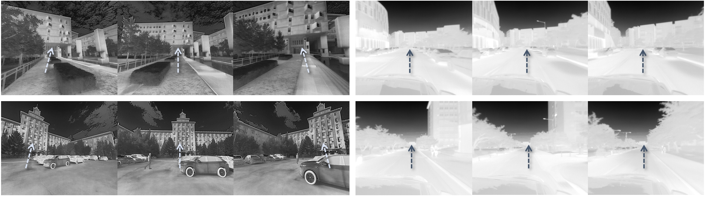

## TEPR

This is the official repository for TEPR.

### Motivation

### Overview of TI-FRD Dataset

Sample ROS bag files and processed data are available on [Google Drive](https://drive.google.com/drive/folders/1M9JcBsdNACmpUVzLlyk_i84T3QL5B6ti?usp=sharing) and [Baidu Netdisk](https://pan.baidu.com/s/1dGu_wxZhNT6S81c2jthRyA?pwd=fvxc) (Access code: fvxc).

  Some examples from the TI-FRD dataset, showing campus scenes with diverse layouts and structures.
  

    Comparison of data acquisition viewpoints in TI-FRD and ViViD++. TI-FRD enables flexible, multi-directional observations, whereas ViViD++'s driving sequences are captured by vehicle-mounted cameras with fixed perspectives. Arrows denote the viewing direction in each image.
    

    The figure shows example RGB images, thermal images, and the corresponding ground-truth depth maps captured under both daytime and nighttime conditions.
    

    Sensor specification for our TI-FRD dataset. acc. and accel. mean range accuracy and acceleration.
    

